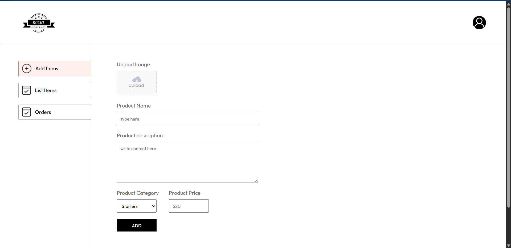
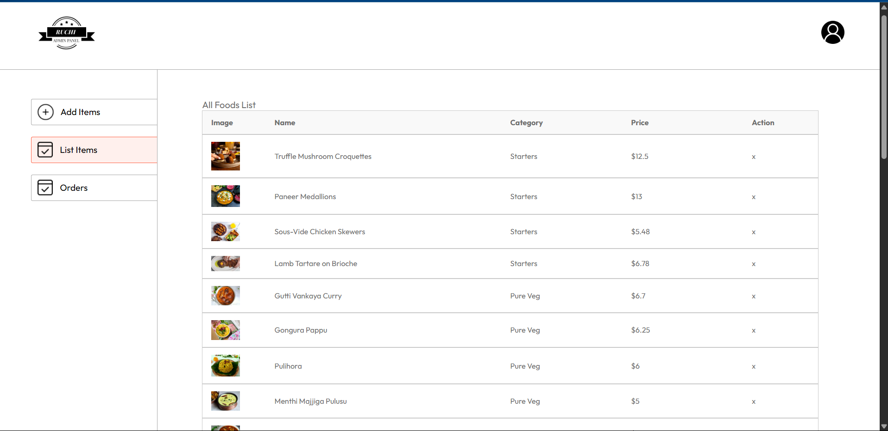

```md
 🛠️ Food Dev – Admin Panel

This is the Admin Dashboard for managing the Food Dev platform. Admins can manage restaurants, food items, and orders from a simple UI.

 📊 Admin Dashboard


 🍽️ Food Management


 🚀 Features

- 🔐 Admin login (if implemented)
- ➕ Add/Edit/Delete food items
- 📦 View and manage orders
- 📱 Responsive dashboard layout

🛠️ Tech Stack

- React
- Vite
- Tailwind CSS
- JavaScript

 📦 Installation

```bash
git clone https://github.com/YOUR_USERNAME/food-dev.git
cd food-dev/admin
npm install
npm run dev
