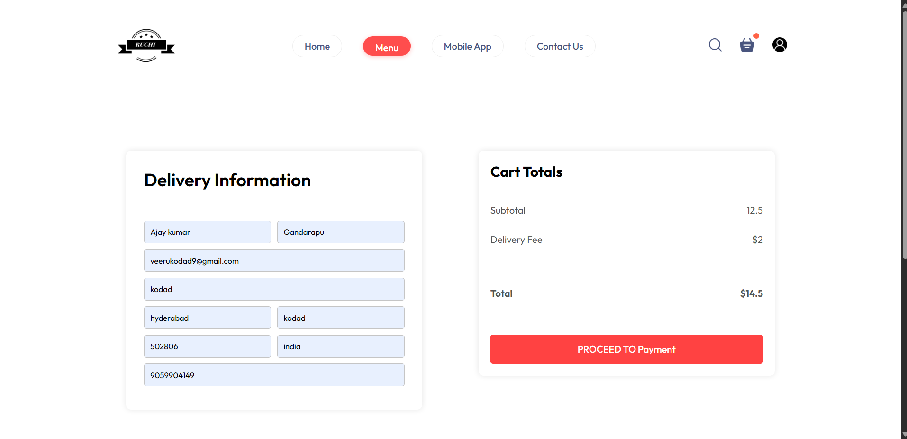

---


```md
 🍽️ Food Dev – Food Ordering Website

A modern frontend food ordering application that allows users to browse, add to cart, and order food online.

 📸 Screenshots

 🏠 Home Page  


🛒 Cart  


 🧾 Checkout  


 🚀 Features

- 🍕 Browse food items and categories
- 🛒 Add to cart & update quantities
- 💳 Checkout page (UI)
- 📱 Responsive design using Tailwind CSS
- 📦 Modular and clean code structure

🛠️ Tech Stack

- React
- Tailwind CSS
- JavaScript
- HTML/CSS

 📦 Installation

```bash
git clone https://github.com/ajaykumar-ai/Food-delivery-website.git
cd Food-delivery-website/frontend
npm install
npm start
